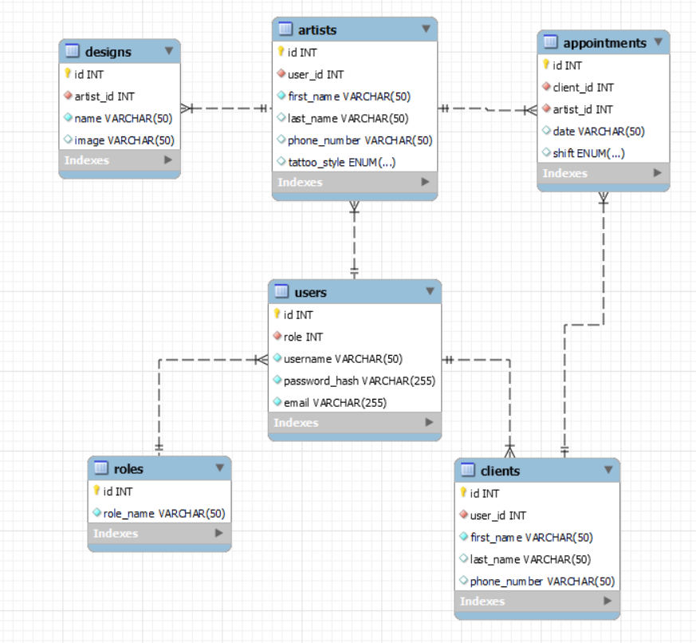

# BackendTattooINK

<details>
  <summary>Contenido 📝</summary>
  <ol>
    <li><a href="#objetivo">Objetivo</a></li>
    <li><a href="#sobre-el-proyecto">Sobre el proyecto</a></li>
    <li><a href="#stack">Stack</a></li>
    <li><a href="#diagrama-bd">Diagrama</a></li>
    <li><a href="#instalación-en-local">Instalación</a></li>
    <li><a href="#endpoints">Endpoints</a></li>
    <li><a href="#futuras-funcionalidades">Futuras funcionalidades</a></li>
    <li><a href="#contribuciones">Contribuciones</a></li>
    <li><a href="#licencia">Licencia</a></li>
    <li><a href="#webgrafia">Webgrafia</a></li>
    <li><a href="#desarrollo">Desarrollo</a></li>
    <li><a href="#agradecimientos">Agradecimientos</a></li>
    <li><a href="#contacto">Contacto</a></li>
  </ol>
</details>

## Objetivo
Este proyecto exigía el desarrollo de una API funcional, la cual debía estar vinculada a una base de datos. Esta base de datos tenía que incluir, como mínimo, una relación de uno a muchos y otra de muchos a muchos, para garantizar una gestión de datos eficiente y versátil.

## Sobre el proyecto
El objetivo es desarrollar una aplicación web para un estudio de tatuajes. Esta plataforma ofrecerá funcionalidades clave como el registro de usuarios, la posibilidad de programar citas con diversos artistas del tatuaje y ejecutar consultas avanzadas en la base de datos. Hasta la fecha, la aplicación ya cuenta con seeders operativos para Roles y Usuarios, proporcionando asignaciones automáticas de roles que facilitan la realización de peticiones básicas sin la necesidad de registrar usuarios manualmente. Entre las capacidades implementadas, se incluyen la inscripción de usuarios, tanto clientes como artistas, así como la eliminación de usuarios mediante su identificador único. Además, la aplicación permite acceder y consultar los perfiles de usuario por identificador y visualizar la lista completa de usuarios registrados.   


## Stack
Tecnologías utilizadas:
<div align="center">
<a href="https://www.mysql.com/">
    
</a>
<a href="https://www.expressjs.com/">
    
</a>
<a href="https://nodejs.org/es/">
    
</a>
<a href="https://developer.mozilla.org/es/docs/Web/JavaScript">
    
</a>
 </div>


## Diagrama BD


## Instalación en local
1. Clonar el repositorio
2. ` $ npm install `
3. Conectamos nuestro repositorio con la base de datos 
4. ``` $ Ejecutamos las migraciones ``` 
5. ``` $ Ejecutamos los seeders ``` 
6. ``` $ npm run dev ``` 

## Endpoints
<details>
<summary>Endpoints</summary>

- AUTH
    - REGISTER

            POST http://localhost:3000/api/register
        body:
        ``` js
            {
                "user": "David",
                "email": "david@david.com",
                "password": "princes"
            }
        ```

    - LOGIN

            POST http://localhost:3000/api/login  
        body:
        ``` js
            {
                "user": "David",
                "email": "david@david.com",
                "password": "princes"
            }
        ```
- RUTINAS
    - RECUPERAR RUTINAS  

            GET http://localhost:3000/api/rutina

    - ...
</details>

## Futuras funcionalidades
[ ] Añadir create book  
[ ] Añadir logs  con winston  
[ ] Validaciones de la solicitud con express-validator  
[ ] ...

## Contribuciones
Las sugerencias y aportaciones son siempre bienvenidas.  

Puedes hacerlo de dos maneras:

1. Abriendo una issue
2. Crea un fork del repositorio
    - Crea una nueva rama  
        ```
        $ git checkout -b feature/nombreUsuario-mejora
        ```
    - Haz un commit con tus cambios 
        ```
        $ git commit -m 'feat: mejora X cosa'
        ```
    - Haz push a la rama 
        ```
        $ git push origin feature/nombreUsuario-mejora
        ```
    - Abre una solicitud de Pull Request

## Licencia
Este proyecto se encuentra bajo licencia de "Mi Nombre"

## Webgrafia:
Para conseguir mi objetivo he recopilado información de:
- link a repositorios 
- link a documentacion de librerias externas
- ...

## Desarrollo:

``` js
 const developer = "datata";

 console.log("Desarrollado por: " + datata);
```  

## Agradecimientos:

Agradezco a mis compañeros el tiempo dedicado a este proyecto:

- *Jose*  
<a href="https://github.com/Dave86dev" target="_blank"></a> 

- **David**  
<a href="https://www.github.com/userGithub/" target="_blank"></a>

- ***Mara***  
<a href="https://www.github.com/userGithub/" target="_blank"></a> 

## Contacto
<a href = "mailto:micorreoelectronico@gmail.com"></a>
<a href="https://www.linkedin.com/in/linkedinUser/" target="_blank"></a> 
</p>